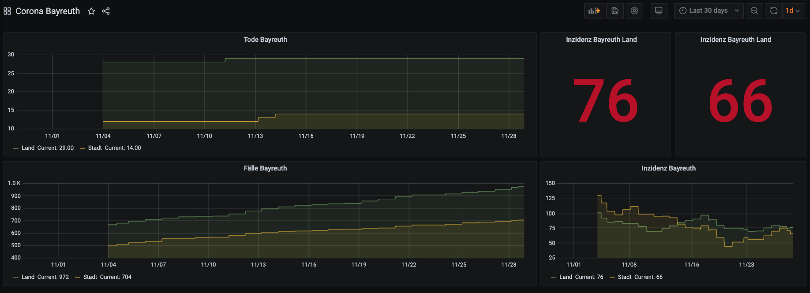

# corona-stats-bayreuth

## Hintergrund

Der Landkreis Bayreuth veröffentlicht unter [landkreis-bayreuth.de](https://www.landkreis-bayreuth.de/der-landkreis/pressemitteilungen/) täglich Meldungen zu Corona Fallzahlen. Diese Daten sind allerdings nicht in maschinenlesbarer Form vorhanden.

Dieses Projekt dient dazu die Rohdaten zu sammeln und Scripte bereitzustellen, mit denen die Daten wieder in Datenbanken für Statistiken, Visualisierungen oder für Apps genutzt werden können.



## Daten aus dem PDF extrahieren

Täglich wird ein PDF mit Fallzahlen veröffentlicht ([tabelle_gemeinden_covid.pdf](https://www.landkreis-bayreuth.de/media/8891/tabelle_gemeinden_covid.pdf)). Dieses PDF bietet unter anderem eine Aufschlüsselung nach Gemeinden.

Eine GitHub Action sammelt diese Daten und legt das letzte PDF im Verzeichnis `raw` ab.

Das PDF kann z.B. mit dem Tool pdftotext ausgewertet werden.

```
-bash$ pdftotext tabelle_gemeinden_covid.pdf

-bash$ cat tabelle_gemeinden_covid.txt
Corona-Fallzahlen LANDKREIS Bayreuth Gemeinde Ahorntal Aufse? Bad Berneck Betzenstein Bindlach Bischofsgr?n Creu?en Eckersdorf Emtmannsberg Fichtelberg Gefrees Gesees Glash?tten Goldkronach Haag Heinersreuth Hollfeld Hummeltal Kirchenpingarten Mehlmeisel Mistelbach Mistelgau Pegnitz Plankenfels Plech Pottenstein Prebitz Schnabelwaid Seybothenreuth Speichersdorf Waischenfeld Warmensteinach Weidenberg Landkreis BT gesamt

26.11.2020 -15:00 Uhr Infektionen insgesamt 24 11 54 32 101 10 36 44 11 9 72 16 8 21 11 30 38 11 7 15 14 24 125 5 13 66 2 11 6 58 11 14 45 955 Genesene 15 10 42 28 88 10 29 37 11 8 64 15 6 18 9 28 31 9 5 12 10 19 98 4 12 43 1 8 6 44 6 12 40 778

Todesf?lle gesamt: 28 aktuell Infizierte 9 1 5 2 5 0 7 7 0 1 6 1 2 2 2 2 6 2 1 2 4 5 25 1 1 23 1 2 0 14 4 2 4 149

,,Genesene" sind sowohl Personen, die mit typischer Symptomatik erkrankt gewesen waren, aber auch solche, bei denen trotz fehlender Krankheitszeichen ein positiver Test auf CoV-2 vorgelegen hatte.

7-Tage-Inzidenz: 80,98
```

## Daten aus der Webseite extrahieren

Eine weitere Datenquelle sind die Pressemeldungen.

Dort tauchen zusätzlich die Daten für Tote und aktuell in Behandlung befindliche Patienten auf.

Diese Daten sind leider komplett manuell als Newseintrag gepflegt. Da das Format der Einträge oftmals geändert wird ist kaum ein automatisches auslesen der Daten möglich. Das Script `corona-bt.py` ist ein erster Versuch die Daten mittels Python Requests und Regular Expressions auszulesen.

### Daten aus letztem Eintrag anzeigen

```
-bash$ ./corona-bt.py | jq 
[
  {
    "date": "2020-11-02 00:00:00",
    "inzidenz": {
      "land": 99.35,
      "stadt": 128.37
    },
    "infected": {
      "current": {
        "land": 140,
        "stadt": 160
      },
      "total": {
        "land": 659,
        "stadt": 492
      }
    },
    "patients": {
      "total": 0,
      "local": 0
    },
    "deaths": {
      "land": 27,
      "stadt": 10
    },
    "recovered": {
      "land": 492,
      "stadt": 331
    }
  }
]
```

### Alle Einträge aus der ersten Seite anzeigen

```
-bash$ ./corona-bt.py -a | jq
```

### Beispiele mit dem Tool jq

```
./corona-bt.py | jq .[0].inzidenz.land
./corona-bt.py | jq .[0].inzidenz.stadt

./corona-bt.py | jq .[0].infected.current.land
./corona-bt.py | jq .[0].infected.current.stadt

./corona-bt.py | jq .[0].infected.total.land
./corona-bt.py | jq .[0].infected.total.stadt
```
